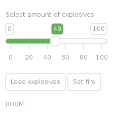

# love2d-ui
Simple UI library for LÖVE framework

## Run the demo
Demo code is inside `main.lua` file.

**Linux**
Type `make` inside cloned repo to test the capabilities of the library.

## Example



```lua
 -- Set up variables used as labels (note the curly brackets)
 explosives = {15}
 boom = {"Not loaded"}

 -- Set up functions for buttons
 function loadCannon () 
    boom[1] = "Loaded" 
 end
 function setFire ()
    -- This ugly [1] access is necessary to make indirect reference
    if boom[1] == "Loaded" then 
       boom[1] = "BOOM!" 
    end
 end

 UI:addScene(20, 20)
 UI:vertical(
    UI:addLabel {"  Select amount of explosives"},
    UI:addSlider( 0, 100, explosives ),
    UI:addLabel {""}
 )
 UI:horizontal(
    UI:addButton( "Load explosives", loadCannon ), 
    UI:addButton( "Set fire", setFire )
 )
 UI:vertical( 
    UI:addLabel {""},
    UI:addLabel( boom ) 
 )
```


*Written in [Lua](https://www.lua.org/) using awesome [love2d](https://love2d.org/) framework.*
